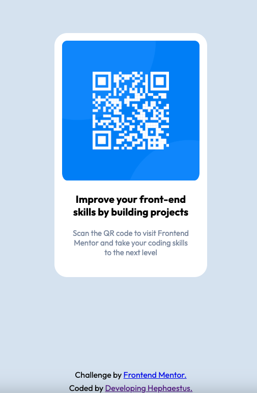

# Frontend Mentor - QR code component solution

This is a solution to the [QR code component challenge on Frontend Mentor](https://www.frontendmentor.io/challenges/qr-code-component-iux_sIO_H). Frontend Mentor challenges help you improve your coding skills by building realistic projects. 

## Table of contents

- [Overview](#overview)
  - [Screenshot](#screenshot)
  - [Links](#links)
- [My process](#my-process)
  - [Built with](#built-with)
  - [What I learned](#what-i-learned)
  - [Continued development](#continued-development)
  - [Useful resources](#useful-resources)
- [Author](#author)

## Overview

### Screenshot

### Links

- Solution URL: [https://github.com/UnknownBuilder/FEmentor_qr-code](https://github.com/UnknownBuilder/FEmentor_qr-code)
- Live Site URL: [https://unknownbuilder.github.io/FEmentor_qr-code/](https://unknownbuilder.github.io/FEmentor_qr-code/)

## My process

### Built with

- CSS
- HTML

### What I learned

- Reacquainted myself with CSS syntax.
- Remembered how to use flexbox to center a div.
- Can't believe I forgot how to link a page.
- Google fonts! 

### Continued development

It's been an while since I learned CSS and forgot most of it so I decided to give a basic challenge a go using Frontend Mentor. Turns out a didn't forget as much as I thought. 

I reacquainted myself with the syntax and it's concepts by Googling what I didn't know and trying to solve the problem as best I could.

While going through this excercise I discovered that all the effort I spent understanding the concepts of HTML and CSS paid off. I didn't remmeber many things when it came to syntax but thanks in large part to my time spent learning the basic theory I was able to satisfactorily complete the challenge with very little issue. 

### Useful resources

- I used google to find out specific syntax to accomplish what I needed to do. 

## Author

I'm a newb right now but I'm learning. 
